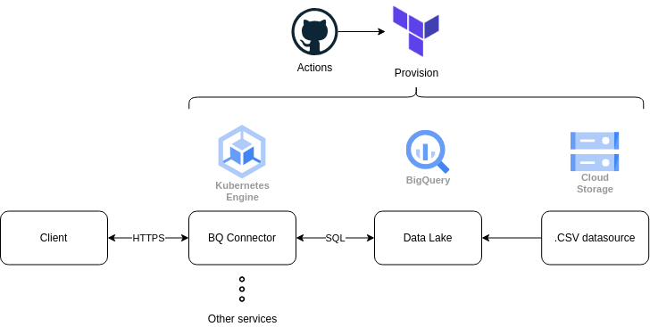

# BQ connect infrastructure

A repo containing deployment configurations for a microservice based BigQuery connector.

## Roadmap:
- [ ] Terraform setup for provisionning.
- [ ] Google Cloud Storage to hold data.
- [ ] BigQuery as a data warehouse.
- [ ] Kubernetes Engine to host services.

## Dependencies:
|Dependency|Version|
|---|---|
|Terraform|v1.1.9|

## Diagram
 