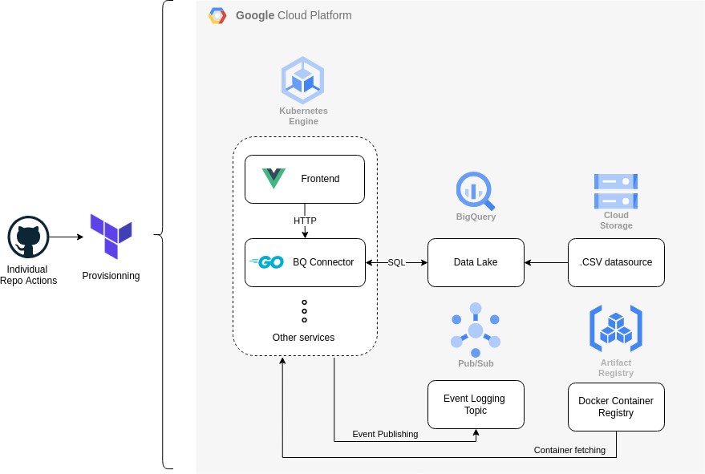

# BQ connect infrastructure

A repo containing IaC configurations for a data lake and microservice connector.

### State
:construction: Project currently a work in progress

### Related Microservice
[bq-connect](https://github.com/VinceDeslo/bq-connect)

#### Related Frontend
[bq-connect-frontend](https://github.com/VinceDeslo/bq-connect-frontend)

### Roadmap:
- [x] Terraform setup for provisionning.
- [x] Google Cloud Storage to hold CSV files.
- [x] BigQuery as a data lake.
- [ ] Google Kubernetes Engine to host microservices.

### Diagram
 
